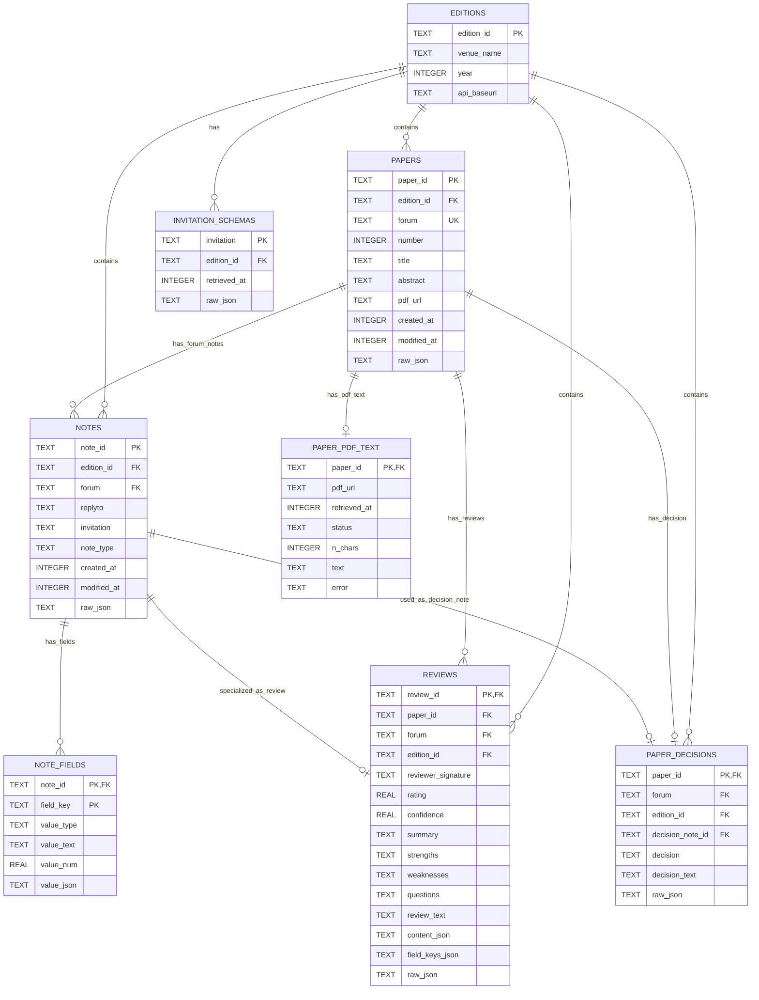

# ICLR Ingestion Database Schema

```mermaid
erDiagram
    EDITIONS ||--o{ PAPERS : contains
    EDITIONS ||--o{ NOTES : contains
    EDITIONS ||--o{ INVITATION_SCHEMAS : has
    EDITIONS ||--o{ REVIEWS : contains
    EDITIONS ||--o{ PAPER_DECISIONS : contains

    PAPERS ||--o{ NOTES : has_forum_notes
    PAPERS ||--o{ REVIEWS : has_reviews
    PAPERS ||--o| PAPER_DECISIONS : has_decision
    PAPERS ||--o| PAPER_PDF_TEXT : has_pdf_text

    NOTES ||--o{ NOTE_FIELDS : has_fields
    NOTES ||--o| REVIEWS : specialized_as_review
    NOTES ||--o| PAPER_DECISIONS : used_as_decision_note

    EDITIONS {
        TEXT edition_id PK
        TEXT venue_name
        INTEGER year
        TEXT api_baseurl
    }

    PAPERS {
        TEXT paper_id PK
        TEXT edition_id FK
        TEXT forum UK
        INTEGER number
        TEXT title
        TEXT abstract
        TEXT pdf_url
        INTEGER created_at
        INTEGER modified_at
        TEXT raw_json
    }

    NOTES {
        TEXT note_id PK
        TEXT edition_id FK
        TEXT forum FK
        TEXT replyto
        TEXT invitation
        TEXT note_type
        INTEGER created_at
        INTEGER modified_at
        TEXT raw_json
    }

    NOTE_FIELDS {
        TEXT note_id PK, FK
        TEXT field_key PK
        TEXT value_type
        TEXT value_text
        REAL value_num
        TEXT value_json
    }

    INVITATION_SCHEMAS {
        TEXT invitation PK
        TEXT edition_id FK
        INTEGER retrieved_at
        TEXT raw_json
    }

    PAPER_PDF_TEXT {
        TEXT paper_id PK, FK
        TEXT pdf_url
        INTEGER retrieved_at
        TEXT status
        INTEGER n_chars
        TEXT text
        TEXT error
    }

    REVIEWS {
        TEXT review_id PK, FK
        TEXT paper_id FK
        TEXT forum FK
        TEXT edition_id FK
        TEXT reviewer_signature
        REAL rating
        REAL confidence
        TEXT summary
        TEXT strengths
        TEXT weaknesses
        TEXT questions
        TEXT review_text
        TEXT content_json
        TEXT field_keys_json
        TEXT raw_json
    }

    PAPER_DECISIONS {
        TEXT paper_id PK, FK
        TEXT forum FK
        TEXT edition_id FK
        TEXT decision_note_id FK
        TEXT decision
        TEXT decision_text
        TEXT raw_json
    }
```
