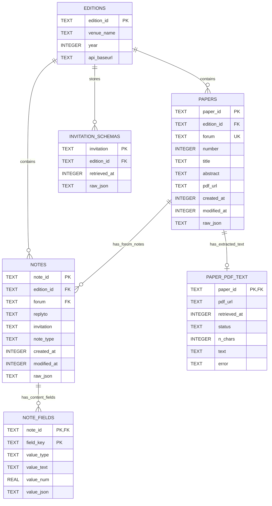

# ICLR Ingestion Database Schema

```mermaid
erDiagram
    EDITIONS ||--o{ PAPERS : contains
    EDITIONS ||--o{ NOTES : contains
    EDITIONS ||--o{ INVITATION_SCHEMAS : stores
    PAPERS ||--o{ NOTES : has_forum_notes
    NOTES ||--o{ NOTE_FIELDS : has_content_fields
    PAPERS ||--o| PAPER_PDF_TEXT : has_extracted_text

    EDITIONS {
        TEXT edition_id PK
        TEXT venue_name
        INTEGER year
        TEXT api_baseurl
    }

    PAPERS {
        TEXT paper_id PK
        TEXT edition_id FK
        TEXT forum UK
        INTEGER number
        TEXT title
        TEXT abstract
        TEXT pdf_url
        INTEGER created_at
        INTEGER modified_at
        TEXT raw_json
    }

    NOTES {
        TEXT note_id PK
        TEXT edition_id FK
        TEXT forum FK
        TEXT replyto
        TEXT invitation
        TEXT note_type
        INTEGER created_at
        INTEGER modified_at
        TEXT raw_json
    }

    NOTE_FIELDS {
        TEXT note_id PK, FK
        TEXT field_key PK
        TEXT value_type
        TEXT value_text
        REAL value_num
        TEXT value_json
    }

    INVITATION_SCHEMAS {
        TEXT invitation PK
        TEXT edition_id FK
        INTEGER retrieved_at
        TEXT raw_json
    }

    PAPER_PDF_TEXT {
        TEXT paper_id PK, FK
        TEXT pdf_url
        INTEGER retrieved_at
        TEXT status
        INTEGER n_chars
        TEXT text
        TEXT error
    }
```
